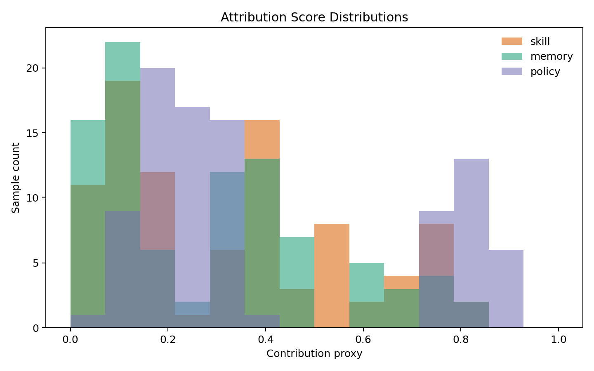
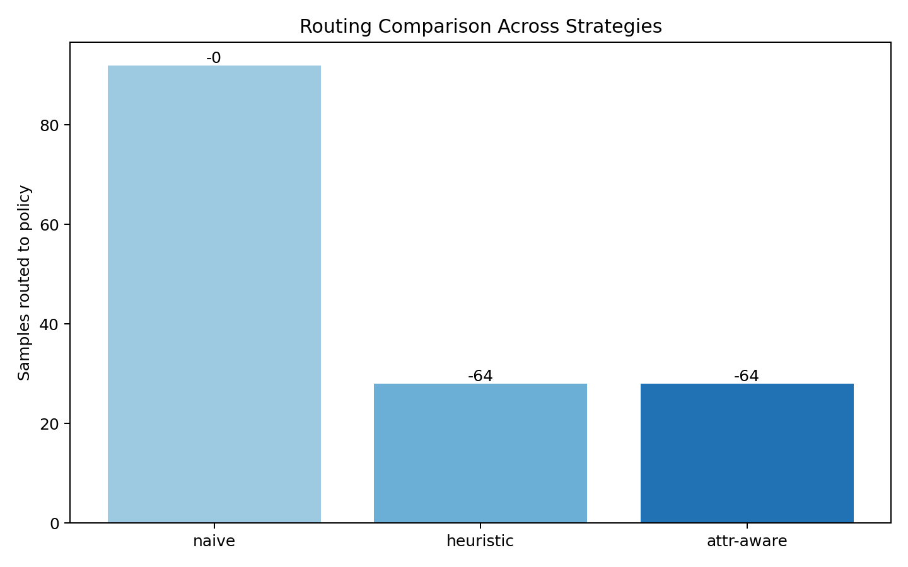
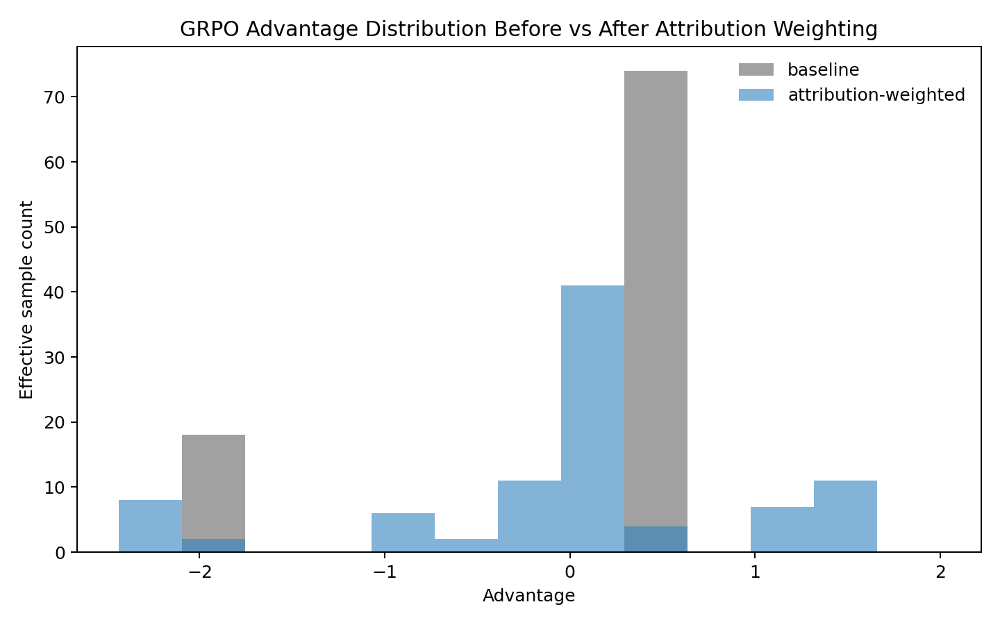
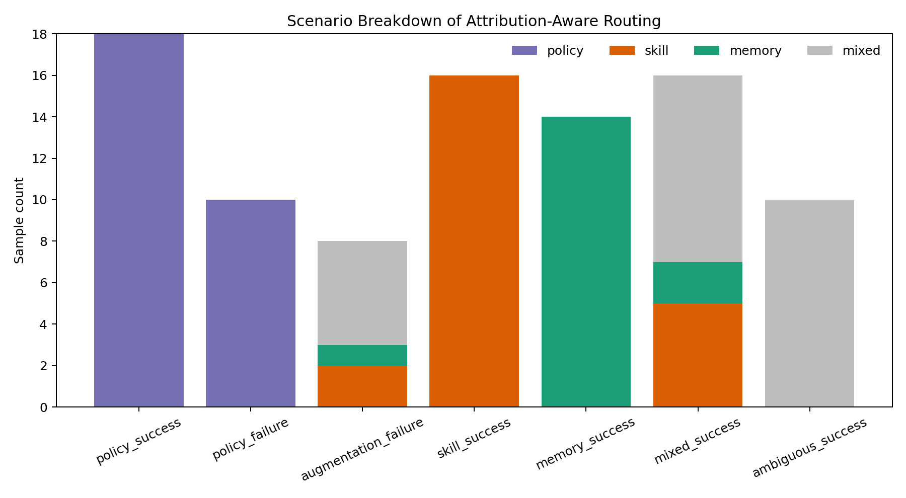

# MetaClaw Attribution Extension

## What problem this project targets

MetaClaw responses are jointly shaped by three sources:

- the base policy
- retrieved skills
- retrieved memory

But the training pipeline still treats the final response as one undifferentiated unit. In the current setup, a skill-driven success can still look like a policy-learning signal.

This extension is a small diagnostic layer around that issue. It asks:

**When a response succeeds, should that signal update the base policy, become a reusable skill, or stay as memory?**

## What I changed

This project has two layers:

1. **Attribution prototype**
   It instruments the real MetaClaw serving path to log which skills and memories were injected, then computes lightweight overlap-based proxies for:
   - skill contribution
   - memory contribution
   - residual policy contribution

2. **Offline training-signal A/B**
   It scores real logged interactions with the PRM and compares:
   - baseline reward / advantage
   - attribution-weighted reward / advantage

The goal is not to claim causal attribution. The goal is to make MetaClaw's learning signal more attributable before changing the full RL rule.

## Main result

On **3 real interactions**, the baseline GRPO-style signal collapsed because the PRM assigned the same positive reward to every sample:

- baseline advantages: `[0.0, 0.0, 0.0]`
- baseline reward std: `0.0`

After attribution-weighting by residual policy contribution:

- weighted reward std: `0.0156`
- weighted advantages: `[-0.115, 1.2782, -1.1632]`

So the current result is:

**the baseline signal had no within-batch discrimination, while the attribution-weighted signal recovered non-zero variance and separated the samples.**

## Where to look

### GitHub entry points

- [Draft PR: offline attribution-weighted training-signal A/B](https://github.com/MaaaryLee/MetaClaw-Merry/pull/1)
- [Prototype branch](https://github.com/MaaaryLee/MetaClaw-Merry/tree/feature/attribution-routing-prototype)
- [Offline A/B branch](https://github.com/MaaaryLee/MetaClaw-Merry/tree/codex/training-signal-ab)

### Core implementation

- [`../metaclaw/attribution.py`](../metaclaw/attribution.py)
  Lightweight attribution logic: estimates skill, memory, and residual policy contribution from overlap signals.

- [`../metaclaw/api_server.py`](../metaclaw/api_server.py)
  Real serving path: injects skills and memories, logs provenance, and writes `training_samples.jsonl`.

- [`run_training_signal_ab.py`](run_training_signal_ab.py)
  Offline A/B script: scores real logged interactions with the PRM and compares baseline vs attribution-weighted rewards.

### Result files

- [`../records/training_signal_ab_summary.json`](../records/training_signal_ab_summary.json)
  Main quantified result: reward variance and advantage comparison.

- [`../records/training_samples_scored.jsonl`](../records/training_samples_scored.jsonl)
  Scored sample log: real interactions plus PRM scores and attribution fields.

- [`../records/training_samples.jsonl`](../records/training_samples.jsonl)
  Raw provenance log: what MetaClaw recorded before offline scoring.

## Quick reproduction

### 1. Generate the demo package

```bash
MPLCONFIGDIR=/tmp/metaclaw-mpl python3 attribution/run_demo.py
```

Success looks like:
- `attribution/demo_training_samples.jsonl` exists
- `attribution/demo_summary.json` exists
- `attribution/figures/` contains 4 PNG files

Failure looks like:
- Python import errors
- matplotlib cache permission issues if `MPLCONFIGDIR` is not writable

### 2. Run the local smoke checks

```bash
python3 attribution/run_local_checks.py
```

Success looks like:
- JSON with `phase_1_provenance`
- JSON with `phase_2_offline_analysis`
- JSON with `phase_3_advantages`

Failure looks like:
- import errors
- missing demo files

### 3. Reproduce the offline training-signal A/B on real logs

```bash
python3 attribution/run_training_signal_ab.py \
  --records records/training_samples.jsonl \
  --config benchmark/scripts/config/skills-only.local.yaml \
  --scored-out records/training_samples_scored.jsonl \
  --summary-out records/training_signal_ab_summary.json
```

Success looks like:
- `records/training_samples_scored.jsonl` exists
- `records/training_signal_ab_summary.json` exists
- the summary shows non-empty `weighted_advantages`

Failure looks like:
- missing API key / config errors
- PRM scorer import errors
- empty or malformed input logs

## Figure outputs

After `run_demo.py`, the advisor-facing figures live in `attribution/figures/`:

1. score distributions
2. routing comparison
3. GRPO advantage shift
4. scenario breakdown

### Preview






## Important scope note

This is **preliminary offline evidence about the training signal**, not yet a claim of downstream RL improvement.

More specifically:

- it shows a real credit-assignment weakness in the current MetaClaw reward path
- it shows that attribution-weighting can fix a specific batch-level collapse case
- it does **not** yet prove end-to-end benchmark gains
- it does **not** yet provide token-level or span-level attribution

## Design discipline

- backward compatible by default
- attribution-weighted training is optional and experimental
- no claim that the overlap proxy is causal
- no requirement to boot the full MetaClaw RL stack just to inspect the prototype
